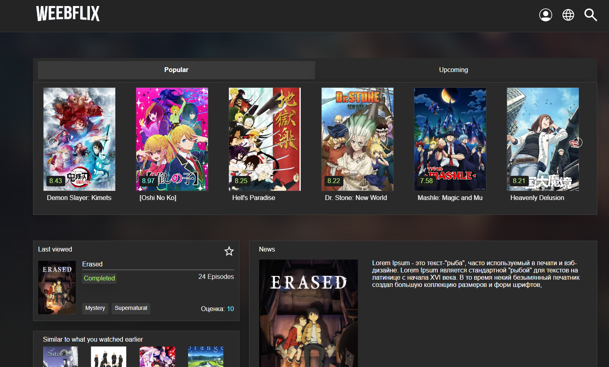
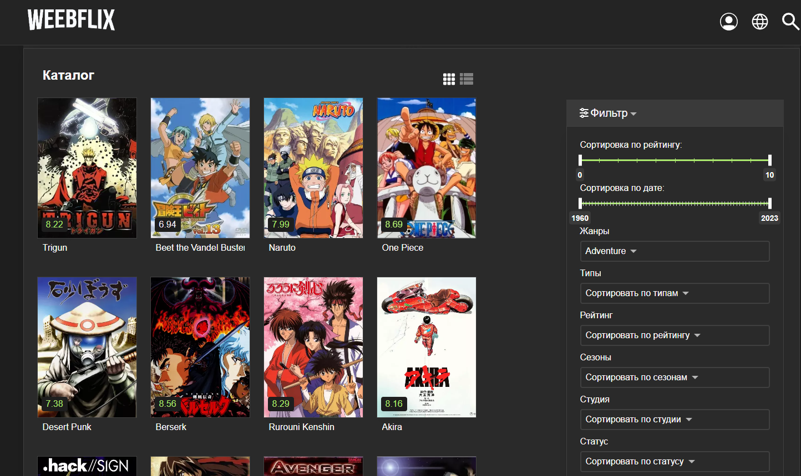
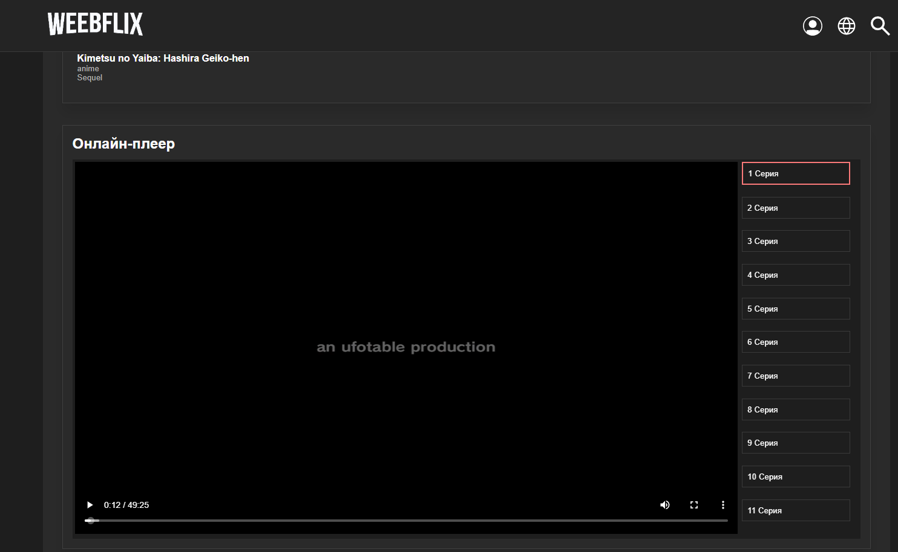

# [Деплой](https://weebflix-remastered.vercel.app/)

---

1. Некоторые фильтры могут не работать из-за проблем в самом апишнике

2. Плеер грузится только при запуске локального бекенда в репозитории https://github.com/Khikmata/weebflix-backend

## Технологии:

`React, typescript, rtk(rtkq), css-modules(scss), webpack, i18n, react-error-bounary router-dom, swiper, axios`

---

## Запуск проекта:

1. Клон репозитория `git clone`
2. Установка пакетов `npm install`
3. Запуск проекта `npm start`

---

## Скриншоты:

---

## Функционал

**- RTK query для фетча данных с разных эндпоинтов**

**- Слайдеры**

**- Переход по карточке**

**- Фильтрация**

**- Пагинация**

**- Поиск**

**- Плеер**

**- Мультиязычность**

**- Переключение каталога между грид/лист модом**

---
